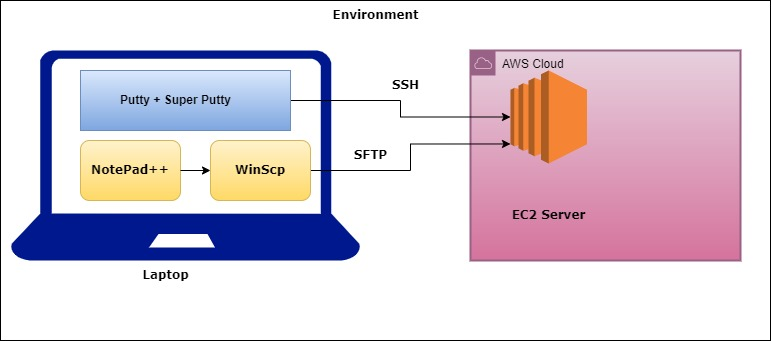

### Shell Scripting

**YouTube PlayList: https://www.youtube.com/playlist?list=PL1jY4BuFJn1cLJ2WCSeQbY0g4ye9gOgEI** 

I am going to cover everything in shell scripting from basics to advanced.

**Pre-requisite:** Linux basic knowledge

#### Environment Setup

https://www.youtube.com/watch?v=AZEX9f_kXcE&list=PL1jY4BuFJn1cLJ2WCSeQbY0g4ye9gOgEI&index=1&t=489s

* You should have AWS account
* Personal laptop with the below tools
    * Putty
    * Super Putty
    * WinScp
    * Notepad++

### OS used

I am mostly using AWS Linux 2. You can use any OS like Ubuntu, Centos, etc. Few commands will be changed based on OS.

* For Ubuntu username is ubuntu.
* For Centos username is centos.
* For AWS Linux 2 username is ec2-user.

